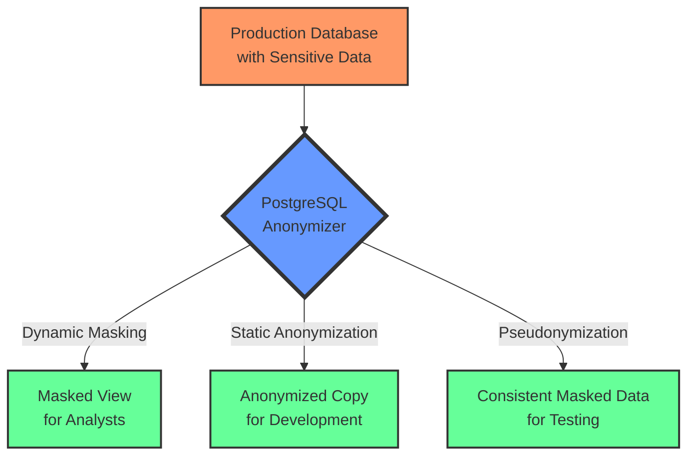
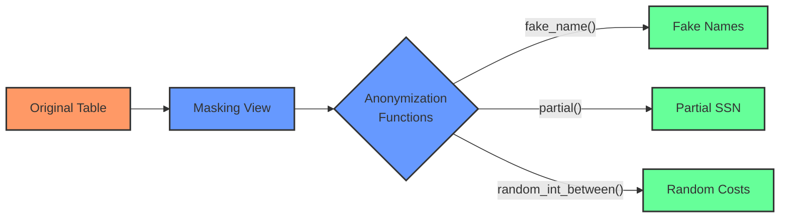
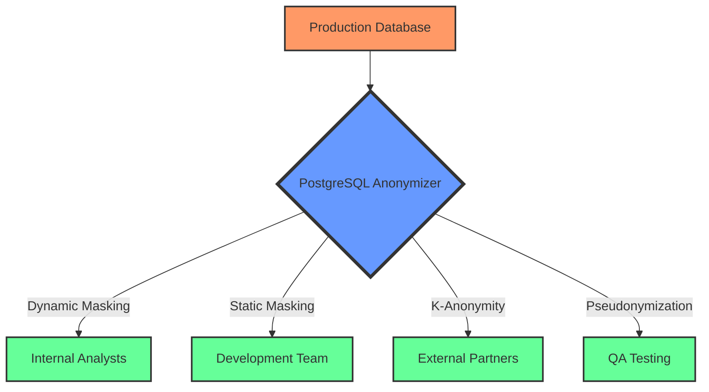

# Securing Sensitive Data in PostgreSQL: A Comprehensive Guide to Data Anonymization

## Introduction: The Hidden Risk in Your Database

In today's data-driven world, your PostgreSQL database likely contains a treasure trove of sensitive information - from personal identifiable information (PII) to financial records and healthcare data. While this data is invaluable for your business, it also represents a significant risk and compliance challenge.

Consider this: According to IBM's Cost of a Data Breach Report, the average cost of a data breach reached $4.45 million in 2023. Yet many organizations continue to use production data with sensitive information in development, testing, and analytics environments.

**What if you could maintain the utility of your data while eliminating the risk of exposing sensitive information?**

This is where PostgreSQL Anonymizer enters the picture - a powerful extension that transforms how you handle sensitive data while maintaining its analytical value.



## The Data Privacy Dilemma

Organizations face an increasingly complex challenge: balancing data utility with privacy requirements. Let's examine why this has become such a critical issue:

### Regulatory Pressure Is Mounting

GDPR, HIPAA, CCPA, and other regulations impose strict requirements on how organizations handle personal data. Non-compliance penalties are severe - up to 4% of annual global turnover under GDPR.

### Development Environments Are Vulnerable

Development and testing environments often lack the robust security controls of production systems, yet they frequently contain copies of production data. This creates a significant attack surface for data breaches.

### Data Sharing Creates Exposure

Sharing data with partners, researchers, or offshore development teams introduces additional risk vectors. Without proper anonymization, each data transfer increases the risk of exposure.

### The Traditional Approaches Fall Short

Many organizations resort to creating fake data or manually scrubbing sensitive information. These approaches are:

- **Time-consuming**: Requiring significant manual effort
- **Error-prone**: Often missing sensitive data in unexpected places
- **Inconsistent**: Creating data that doesn't reflect real-world patterns
- **Inflexible**: Failing to adapt to changing data structures

A CTO at a healthcare provider described their situation: *"We were spending weeks creating synthetic patient data for our development team, only to discover it didn't reflect the edge cases found in production. This led to bugs that only appeared after deployment."*

## Understanding PostgreSQL Anonymizer

PostgreSQL Anonymizer is an extension that provides a declarative approach to data masking and anonymization directly within your PostgreSQL database.

### Technical Background

Built as a native PostgreSQL extension, PostgreSQL Anonymizer integrates seamlessly with your existing database infrastructure. It leverages PostgreSQL's security label system to define masking rules directly in your database schema.

<div style="text-align:center">
<svg width="600" height="300" xmlns="http://www.w3.org/2000/svg">
  <!-- PostgreSQL Database -->
  <rect x="50" y="50" width="500" height="200" rx="10" ry="10" fill="#336791" stroke="#000" stroke-width="2"/>
  <text x="300" y="85" font-family="Arial" font-size="20" fill="white" text-anchor="middle">PostgreSQL Database</text>
  
  <!-- Anon Extension -->
  <rect x="100" y="110" width="400" height="50" rx="5" ry="5" fill="#4e8cb9" stroke="#000" stroke-width="1"/>
  <text x="300" y="140" font-family="Arial" font-size="16" fill="white" text-anchor="middle">PostgreSQL Anonymizer Extension</text>
  
  <!-- Masking Functions -->
  <rect x="100" y="180" width="120" height="40" rx="5" ry="5" fill="#5fa7db" stroke="#000" stroke-width="1"/>
  <text x="160" y="205" font-family="Arial" font-size="12" fill="white" text-anchor="middle">Masking Functions</text>
  
  <!-- Security Labels -->
  <rect x="240" y="180" width="120" height="40" rx="5" ry="5" fill="#5fa7db" stroke="#000" stroke-width="1"/>
  <text x="300" y="205" font-family="Arial" font-size="12" fill="white" text-anchor="middle">Security Labels</text>
  
  <!-- Dynamic Views -->
  <rect x="380" y="180" width="120" height="40" rx="5" ry="5" fill="#5fa7db" stroke="#000" stroke-width="1"/>
  <text x="440" y="205" font-family="Arial" font-size="12" fill="white" text-anchor="middle">Dynamic Views</text>
</svg>
</div>

### Key Features

1. **Declarative Approach**: Define masking rules directly in your database schema
2. **Multiple Masking Methods**: Choose from dynamic masking, static masking, masking views, or anonymized dumps
3. **Rich Function Library**: Over 50 built-in functions for various anonymization needs
4. **Role-Based Access**: Apply different masking rules based on user roles
5. **Performance Optimized**: Designed for minimal impact on database performance

## Implementing PostgreSQL Anonymizer: A Step-by-Step Guide

Let's walk through implementing PostgreSQL Anonymizer in a real-world scenario.

### Step 1: Installation and Setup

The easiest way to get started is using Docker:

```bash
# Pull the PostgreSQL Anonymizer Docker image
docker pull registry.gitlab.com/dalibo/postgresql_anonymizer:stable

# Run the container
docker run -d --name pg-anon -e POSTGRES_PASSWORD=mysecretpassword -p 5433:5432 registry.gitlab.com/dalibo/postgresql_anonymizer:stable
```

Connect to the database and initialize the extension:

```bash
# Connect to the database
PGPASSWORD=mysecretpassword psql -h localhost -p 5433 -U postgres -d postgres

# Initialize the extension
postgres=# SELECT anon.init();
```

Output:
```
 init 
------
 t
(1 row)
```

### Step 2: Creating Sample Data with Sensitive Information

Let's create a healthcare scenario with patient data:

```sql
-- Create a patients table with sensitive data
CREATE TABLE patients (
    id SERIAL PRIMARY KEY,
    patient_name TEXT,
    date_of_birth DATE,
    ssn TEXT,
    diagnosis TEXT,
    insurance_id TEXT,
    treatment_cost DECIMAL(10,2)
);

-- Insert sample data
INSERT INTO patients (patient_name, date_of_birth, ssn, diagnosis, insurance_id, treatment_cost)
VALUES 
('John Smith', '1985-03-15', '123-45-6789', 'Hypertension', 'INS-987654', 1250.75),
('Jane Doe', '1972-11-08', '987-65-4321', 'Type 2 Diabetes', 'INS-876543', 2340.50),
('Bob Johnson', '1990-07-22', '456-78-9012', 'Asthma', 'INS-765432', 890.25);
```

### Step 3: Implementing Different Anonymization Techniques

PostgreSQL Anonymizer offers multiple approaches to protect sensitive data. Let's explore the most effective ones:

#### Approach 1: Masking Views

Creating views that apply anonymization functions is straightforward:

```sql
-- Create a masked view of the patients table
CREATE VIEW masked_patients AS
SELECT 
    id,
    anon.fake_first_name() || ' ' || anon.fake_last_name() AS patient_name,
    date_of_birth,
    anon.partial(ssn, 0, '***-**-', 4) AS ssn,
    diagnosis,
    anon.partial(insurance_id, 4, '-XXX', 0) AS insurance_id,
    anon.random_int_between(500, 5000)::DECIMAL(10,2) AS treatment_cost
FROM patients;

-- Query the masked view
SELECT * FROM masked_patients;
```

Output:
```
 id |    patient_name    | date_of_birth |     ssn     |    diagnosis    | insurance_id | treatment_cost 
----+-------------------+---------------+-------------+----------------+--------------+----------------
  1 | Robert Williams   | 1985-03-15    | ***-**-6789 | Hypertension   | INS-XXX      |        2134.50
  2 | Maria Johnson     | 1972-11-08    | ***-**-4321 | Type 2 Diabetes| INS-XXX      |        3421.75
  3 | Thomas Brown      | 1990-07-22    | ***-**-9012 | Asthma         | INS-XXX      |        1567.25
(3 rows)
```



#### Approach 2: Dynamic Masking with Security Labels

Dynamic masking applies different masking rules based on the user's role:

```sql
-- Create a masked role
CREATE ROLE doctor WITH LOGIN PASSWORD 'doctor_password';
GRANT CONNECT ON DATABASE postgres TO doctor;
GRANT USAGE ON SCHEMA public TO doctor;
GRANT SELECT ON patients TO doctor;
GRANT USAGE ON SCHEMA anon TO doctor;

-- Define masking rules using security labels
SECURITY LABEL FOR anon ON COLUMN patients.ssn IS 'MASKED WITH FUNCTION anon.partial(ssn, 0, ''***-**-'', 4)';
SECURITY LABEL FOR anon ON COLUMN patients.insurance_id IS 'MASKED WITH FUNCTION anon.partial(insurance_id, 4, ''-XXX'', 0)';
SECURITY LABEL FOR anon ON COLUMN patients.treatment_cost IS 'MASKED WITH FUNCTION anon.random_int_between(500, 5000)::DECIMAL(10,2)';

-- Activate dynamic masking for the role
SECURITY LABEL FOR anon ON ROLE doctor IS 'MASKED';

-- Update the masking rules
SELECT anon.mask_update();
```

Now when a doctor logs in, they'll see masked data for sensitive fields while maintaining access to medical information:

```sql
-- Connect as doctor
PGPASSWORD=doctor_password psql -h localhost -p 5433 -U doctor -d postgres -c "SELECT * FROM patients;"
```

Output:
```
 id | patient_name |  date_of_birth  |     ssn     |    diagnosis    | insurance_id | treatment_cost 
----+-------------+----------------+-------------+----------------+--------------+----------------
  1 | John Smith  | 1985-03-15     | ***-**-6789 | Hypertension   | INS-XXX      |        3421.50
  2 | Jane Doe    | 1972-11-08     | ***-**-4321 | Type 2 Diabetes| INS-XXX      |        2876.25
  3 | Bob Johnson | 1990-07-22     | ***-**-9012 | Asthma         | INS-XXX      |        1543.75
(3 rows)
```

This output demonstrates how the doctor role can see the actual patient names and medical diagnoses (which they need for treatment purposes), while sensitive information like SSN, insurance ID, and treatment costs are masked according to the security labels we defined.

#### Approach 3: Pseudonymization for Data Consistency

Pseudonymization is a sophisticated anonymization technique that replaces identifying information with artificial identifiers (pseudonyms) in a consistent manner. Unlike random masking or generalization, pseudonymization ensures that the same input value always produces the same output value across all occurrences in the database.

```sql
-- Create a pseudonymization function
CREATE OR REPLACE FUNCTION get_pseudonym(value TEXT) 
RETURNS TEXT AS $$
BEGIN
    RETURN anon.pseudo_first_name(value) || ' ' || anon.pseudo_last_name(value);
END;
$$ LANGUAGE plpgsql SECURITY DEFINER;

-- Apply pseudonymization
SELECT id, get_pseudonym(patient_name) AS patient_name, diagnosis 
FROM patients;
```

Output:
```
 id |    patient_name    |    diagnosis    
----+-------------------+----------------
  1 | Robert Williams   | Hypertension
  2 | Maria Johnson     | Type 2 Diabetes
  3 | Thomas Brown      | Asthma
(3 rows)
```

The key difference with pseudonymization is that the same input always produces the same output, maintaining data relationships.

#### Approach 4: K-Anonymity for Statistical Data

K-anonymity ensures that each combination of quasi-identifiers appears at least k times:

```sql
-- Create a table with quasi-identifiers
CREATE TABLE patient_demographics (
    id SERIAL PRIMARY KEY,
    age INTEGER,
    zip_code TEXT,
    gender TEXT,
    condition TEXT
);

-- Insert sample data
INSERT INTO patient_demographics (age, zip_code, gender, condition)
VALUES 
(32, '12345', 'M', 'Hypertension'),
(33, '12345', 'M', 'Diabetes'),
(45, '23456', 'F', 'Asthma'),
(28, '34567', 'F', 'Diabetes'),
(29, '34567', 'F', 'Hypertension');

-- Create a k-anonymous view (k=2)
CREATE VIEW k_anonymous_patients AS
SELECT 
    -- Generalize age into age groups
    CASE 
        WHEN age < 30 THEN '20-29'
        WHEN age < 40 THEN '30-39'
        ELSE '40+'
    END AS age_group,
    -- Truncate zip code to first 3 digits
    substring(zip_code, 1, 3) AS zip_prefix,
    gender,
    condition
FROM patient_demographics
GROUP BY age_group, zip_prefix, gender, condition
HAVING COUNT(*) >= 2;

-- Query the k-anonymous view
SELECT * FROM k_anonymous_patients;
```

Output:
```
 age_group | zip_prefix | gender |   condition   
-----------+------------+--------+---------------
 20-29     | 345        | F      | Hypertension
 30-39     | 123        | M      | Hypertension
(2 rows)
```

<div style="text-align:center">
<svg width="600" height="400" xmlns="http://www.w3.org/2000/svg">
  <rect x="50" y="50" width="500" height="300" rx="10" ry="10" fill="#f0f0f0" stroke="#000" stroke-width="2"/>
  <text x="300" y="85" font-family="Arial" font-size="20" fill="#333" text-anchor="middle">Anonymization Techniques Comparison</text>
  
  <!-- Headers -->
  <text x="150" y="120" font-family="Arial" font-size="16" fill="#333" text-anchor="middle">Technique</text>
  <text x="350" y="120" font-family="Arial" font-size="16" fill="#333" text-anchor="middle">Best For</text>
  <text x="500" y="120" font-family="Arial" font-size="16" fill="#333" text-anchor="middle">Data Utility</text>
  
  <!-- Line -->
  <line x1="50" y1="130" x2="550" y2="130" stroke="#333" stroke-width="1"/>
  
  <!-- Dynamic Masking -->
  <text x="150" y="160" font-family="Arial" font-size="14" fill="#333" text-anchor="middle">Dynamic Masking</text>
  <text x="350" y="160" font-family="Arial" font-size="14" fill="#333" text-anchor="middle">Role-based access</text>
  <rect x="460" y="150" width="80" height="15" fill="#69f" stroke="#333" stroke-width="1"/>
  
  <!-- Static Masking -->
  <text x="150" y="200" font-family="Arial" font-size="14" fill="#333" text-anchor="middle">Static Masking</text>
  <text x="350" y="200" font-family="Arial" font-size="14" fill="#333" text-anchor="middle">Data exports</text>
  <rect x="460" y="190" width="60" height="15" fill="#69f" stroke="#333" stroke-width="1"/>
  
  <!-- Pseudonymization -->
  <text x="150" y="240" font-family="Arial" font-size="14" fill="#333" text-anchor="middle">Pseudonymization</text>
  <text x="350" y="240" font-family="Arial" font-size="14" fill="#333" text-anchor="middle">Preserving relationships</text>
  <rect x="460" y="230" width="100" height="15" fill="#69f" stroke="#333" stroke-width="1"/>
  
  <!-- K-Anonymity -->
  <text x="150" y="280" font-family="Arial" font-size="14" fill="#333" text-anchor="middle">K-Anonymity</text>
  <text x="350" y="280" font-family="Arial" font-size="14" fill="#333" text-anchor="middle">Statistical analysis</text>
  <rect x="460" y="270" width="90" height="15" fill="#69f" stroke="#333" stroke-width="1"/>
  
  <!-- Noise Addition -->
  <text x="150" y="320" font-family="Arial" font-size="14" fill="#333" text-anchor="middle">Noise Addition</text>
  <text x="350" y="320" font-family="Arial" font-size="14" fill="#333" text-anchor="middle">Numeric data</text>
  <rect x="460" y="310" width="70" height="15" fill="#69f" stroke="#333" stroke-width="1"/>
</svg>
</div>

### Step 4: Exporting Anonymized Data

For sharing data with external teams or creating development environments, you can export anonymized data:

```bash
# Export a masked view
docker exec pg-anon pg_dump -d postgres -U postgres -t masked_patients > masked_patients_dump.sql

# Import into a development database
docker exec -i pg-anon psql -U postgres -c "CREATE DATABASE dev_db;"
docker exec -i pg-anon psql -U postgres -d dev_db < masked_patients_dump.sql
```

## Real-World Applications

### Case Study 1: Healthcare Provider

A large healthcare provider needed to share patient data with researchers while complying with HIPAA regulations. They implemented PostgreSQL Anonymizer with the following approach:

1. **Dynamic Masking**: Created role-based access where:
   - Doctors could see diagnoses but masked patient identifiers
   - Researchers saw fully anonymized data with k-anonymity applied
   - Administrators had full access to all data

2. **Pseudonymization**: Applied consistent pseudonyms to patient identifiers to maintain data relationships for longitudinal studies.

3. **Data Export**: Generated fully anonymized exports for external research partners.

**Results**: The provider maintained HIPAA compliance while enabling valuable research. Data utility was preserved for statistical analysis, and the risk of re-identification was minimized.

### Case Study 2: Financial Institution

A multinational bank needed to create realistic test environments for their application development teams without exposing sensitive customer data.

1. **Masked Views**: Created views that preserved transaction patterns while masking account details and personal information.

2. **Static Masking**: Applied permanent anonymization to development databases.

3. **K-Anonymity**: Ensured that customer segments couldn't be re-identified in analytics datasets.

**Results**: Development teams gained access to realistic test data that reflected production patterns without exposing sensitive information. The bank achieved compliance with financial regulations while accelerating their development cycle.



## Performance and Scalability Considerations

When implementing PostgreSQL Anonymizer in production environments, consider these performance optimizations:

1. **Use Materialized Views**: For large datasets, materialized views provide better performance than regular views:

```sql
CREATE MATERIALIZED VIEW masked_patients_mat AS 
SELECT * FROM masked_patients;

-- Refresh when data changes
REFRESH MATERIALIZED VIEW masked_patients_mat;
```

2. **Batch Processing**: For static masking of large tables, process in batches:

```sql
DO $$
DECLARE
    batch_size INT := 10000;
    max_id INT;
    current_id INT := 0;
BEGIN
    SELECT MAX(id) INTO max_id FROM large_table;
    WHILE current_id <= max_id LOOP
        -- Process batch
        UPDATE large_table 
        SET email = anon.partial_email(email)
        WHERE id > current_id AND id <= current_id + batch_size;
        
        current_id := current_id + batch_size;
        COMMIT;
    END LOOP;
END $$;
```

3. **Function Complexity**: Simpler masking functions perform better at scale. Consider the performance impact when choosing between complex randomization and simpler masking techniques.

## Beyond Basic Anonymization: Advanced Features

PostgreSQL Anonymizer offers several advanced capabilities beyond basic data masking:

### 1. Consistent Anonymization Across Databases

Ensure consistent pseudonyms across multiple databases:

```sql
-- Create a shared salt for pseudonymization
CREATE TABLE anon.salt (
    id SERIAL PRIMARY KEY,
    name TEXT UNIQUE,
    value TEXT
);

INSERT INTO anon.salt (name, value) VALUES ('global_salt', 'my-organization-salt');

-- Use the salt in pseudonymization
CREATE OR REPLACE FUNCTION consistent_pseudo(text) RETURNS TEXT AS $$
DECLARE
    salt_value TEXT;
BEGIN
    SELECT value INTO salt_value FROM anon.salt WHERE name = 'global_salt';
    RETURN anon.pseudo_first_name($1, salt_value);
END;
$$ LANGUAGE plpgsql;
```

### 2. Differential Privacy

Implement differential privacy by adding calibrated noise to aggregate queries:

```sql
-- Add noise to salary data
SELECT 
    department,
    AVG(salary) + anon.noise(0, 500) AS approx_avg_salary,
    COUNT(*) + anon.noise(0, 2)::INTEGER AS approx_count
FROM employees
GROUP BY department;
```

### 3. Data Synthesis

Generate synthetic data that maintains statistical properties of the original:

```sql
-- Create a synthetic patients table based on statistical distribution
CREATE TABLE synthetic_patients AS
SELECT
    generate_series(1, 1000) AS id,
    anon.fake_first_name() || ' ' || anon.fake_last_name() AS patient_name,
    anon.random_date_between('1940-01-01'::date, '2000-12-31'::date) AS date_of_birth,
    CASE anon.random_int_between(1, 4)
        WHEN 1 THEN 'Hypertension'
        WHEN 2 THEN 'Diabetes'
        WHEN 3 THEN 'Asthma'
        WHEN 4 THEN 'Arthritis'
    END AS diagnosis,
    'INS-' || anon.random_string(6) AS insurance_id,
    (anon.random_int_between(500, 5000))::DECIMAL(10,2) AS treatment_cost;
```

## Conclusion: Balancing Data Utility and Privacy

PostgreSQL Anonymizer provides a powerful solution to the data privacy dilemma, enabling organizations to:

1. **Comply with Regulations**: Meet GDPR, HIPAA, CCPA, and other regulatory requirements
2. **Protect Sensitive Data**: Minimize the risk of data breaches in non-production environments
3. **Maintain Data Utility**: Preserve the analytical value of data while protecting privacy
4. **Implement Privacy by Design**: Build data protection directly into database schemas

By implementing PostgreSQL Anonymizer, organizations can transform their approach to sensitive data, reducing risk while enabling innovation.

## Next Steps

Ready to implement PostgreSQL Anonymizer in your environment? Here's how to get started:

1. **Install PostgreSQL Anonymizer**: Follow the [installation guide](https://postgresql-anonymizer.readthedocs.io/en/latest/INSTALL/)
2. **Identify Sensitive Data**: Audit your databases to identify PII and sensitive information
3. **Define Your Anonymization Strategy**: Choose the appropriate techniques for your use cases
4. **Implement Masking Rules**: Apply security labels or create masked views
5. **Test and Validate**: Ensure your anonymization preserves data utility while protecting privacy

### Resources

- [PostgreSQL Anonymizer Documentation](https://postgresql-anonymizer.readthedocs.io/)
- [PostgreSQL Anonymizer GitHub Repository](https://gitlab.com/dalibo/postgresql_anonymizer)
- [GDPR Compliance Guide](https://gdpr.eu/compliance/)
- [HIPAA Privacy Rule](https://www.hhs.gov/hipaa/for-professionals/privacy/index.html)

Share your experiences with PostgreSQL Anonymizer in the comments below. How has your organization addressed the challenge of protecting sensitive data while maintaining its utility?
